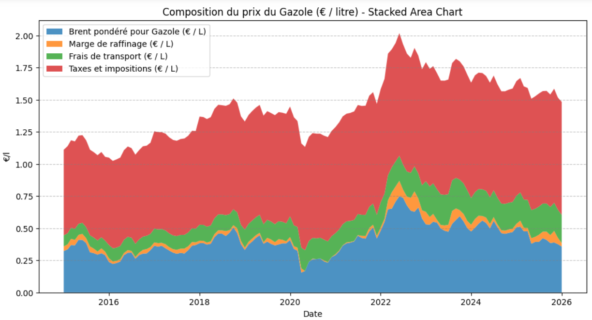

# DataPipeline French Fuel Cost Decomposition

This project uses only **public government data**.

It collects various datasets, applies transformations according to the business rules of the petroleum industry, and produces a chart that provides an overview of the different components of the price of a liter of French gazole.

## Business Rules
Here are the business rules, [based on the official data source](./documentation/assets/business_explanation_gazole_composition_NPG-2026.02.13.pdf)

## Datasources

- EUR/USD cotation:
Yfinance library (EURUSD=X)

- BRENT cotation USD/Barrel :
Yfinance library (BZ=F)

- Refined Margin Brent USD/Barrel:
https://www.ecologie.gouv.fr/politiques-publiques/prix-produits-petroliers (download dataset)

- Gazole HTT and TTC EUR/Liter:
https://www.ecologie.gouv.fr/politiques-publiques/prix-produits-petroliers (using bot for fill formulary, and download dataset)

- Transportation Fees CtsEur/Liter:
https://www.ecologie.gouv.fr/politiques-publiques/prix-produits-petroliers (using web scrapping for create dataset)

## Pipeline Explanation

1. **Retrieve the EUR/USD exchange rate**, keep only the first value of each month, and save it as a CSV.  
2. **Retrieve the BRENT price (USD/barrel)**, convert it to EUR/liter using the EUR/USD rate, and save it as a CSV.  
3. **Retrieve the Refined Margin Brent (USD/barrel)**, convert it to EUR/liter using the EUR/USD rate, and save it as a CSV.  
4. Use a Python bot (Selenium) to fill a web form, retrieve a download link, and download the **Gazole price datasets (HTT and TTC)**. Merge the two datasets, convert French date formats to Datetime, and save as CSV.  
5. Use a Python bot (Selenium) to **web scrape the annual transportation fees** (in euro cents per liter). Convert the dataset to monthly values in euros per liter, and save as CSV.  
6. **Combine all datasets into a single table** (Brent price / Refining Margin / Gazole HTT and TTC prices / transportation fees). **Use this unified table for visualization** into a Stacked Area Chart (from 2015 to present).
